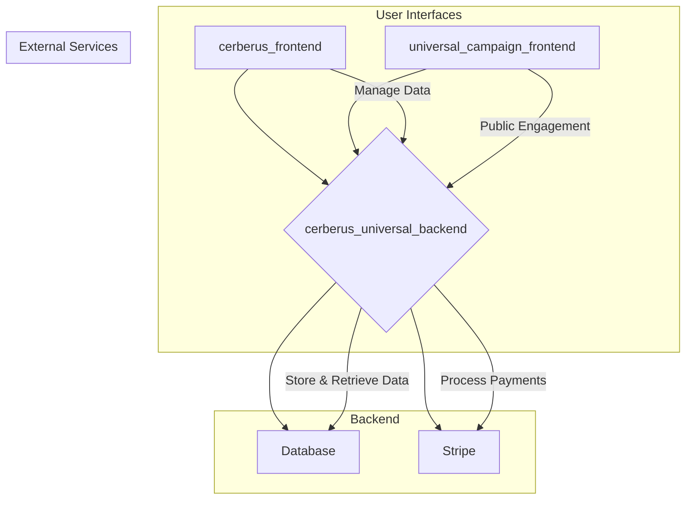

# Cerberus Data Cloud: Project Architecture

This document outlines the architecture of the Cerberus-Data-Cloud project, detailing the structure, data flows, and component interactions of the `cerberus_universal_backend`, `cerberus_frontend`, and `universal_campaign_frontend`.

## 1. High-Level Architecture

The Cerberus-Data-Cloud project is a comprehensive system designed for political campaign management. It consists of a central backend, a data management frontend, and a template-based system for creating public-facing campaign websites.



## 2. Directory Structure

```
Cerberus-Data-Cloud/
├── cerberus_frontend/         # Flutter web app for data management
├── cerberus_universal_backend/ # Flask backend API
└── universal_campaign_frontend/ # Flutter template for campaign websites
```

## 3. `cerberus_universal_backend`

The `cerberus_universal_backend` is a monolithic Flask application that serves as the central API for the entire system.

### 3.1. Framework and Libraries

*   **Web Framework:** Flask
*   **Database ORM:** SQLAlchemy
*   **Database:** PostgreSQL
*   **Authentication:** JWT (JSON Web Tokens) and Bcrypt for password hashing
*   **Payments:** Stripe
*   **Migrations:** Flask-Migrate

### 3.2. API Endpoints

The backend exposes a RESTful API with the following blueprints:

*   **/api/v1/auth**: Handles user registration and login.
*   **/api/v1/voters**: Provides CRUD operations for managing persons and their data, including a CSV upload feature.
*   **/api/v1/donate**: Integrates with Stripe to process donations.
*   **/api/v1/agendas**: Allows searching and subscribing to government agendas.
*   **/api/v1**: Contains public-facing endpoints, such as the sign-up form for the campaign websites.

### 3.3. Database Models

The database schema is extensive and well-structured, with over 20 tables. Key models include:

*   `Person`: The central model, representing an individual.
*   `Campaign`: Represents a political campaign.
*   `Donation`: Stores information about donations, linked to Stripe Payment Intents.
*   `Agenda`: Stores government agenda information.
*   `User`: Represents a user of the `cerberus_frontend`.

### 3.4. Stripe Integration

The payment processing workflow is as follows:

1.  The frontend requests a `PaymentIntent` from the backend.
2.  The backend creates a `PaymentIntent` with Stripe and a `Donation` record in the database.
3.  The frontend uses the `clientSecret` from the `PaymentIntent` to confirm the payment with Stripe.
4.  Stripe sends a webhook to the backend to confirm the payment success.
5.  The backend updates the `Donation` record's status to 'succeeded'.

## 4. `cerberus_frontend`

The `cerberus_frontend` is a Flutter web application that provides a user interface for managing the data in the `cerberus_universal_backend`.

### 4.1. Structure and Features

*   **Framework:** Flutter
*   **Routing:** `go_router`
*   **Features:**
    *   **Home:** Dashboard/landing page.
    *   **About:** Information about the platform.
    *   **Contact:** Contact information.
    *   **Report:** View and generate reports.
    *   **Upload:** Upload CSV data of persons.

### 4.2. Backend Communication

The `cerberus_frontend` communicates with the `cerberus_universal_backend` via the authenticated API endpoints (e.g., `/api/v1/voters`). It uses the `http` package to make REST API calls.

## 5. `universal_campaign_frontend`

The `universal_campaign_frontend` is a Flutter-based template engine for creating multiple, unique campaign websites.

### 5.1. Multi-Website Mechanism

The system uses a configuration-driven approach to generate different websites from a single codebase.

1.  **Domain-based Configuration:** The application identifies the campaign to display based on the browser's hostname.
2.  **Configuration Loading:** A `config_loader.dart` file retrieves the appropriate `CampaignConfig` object.
3.  **Dynamic UI:** The `CampaignConfig` object provides all the necessary data to customize the website, including:
    *   `siteTitle`
    *   `theme` (colors, fonts, logo)
    *   `stripe` (public key, connected account ID)
    *   `content` (hero text, calls to action)
    *   `issues` and `endorsements`

### 5.2. Backend Communication

This frontend interacts with the public-facing endpoints of the `cerberus_universal_backend`, such as:

*   `/api/v1/signups`: To submit contact forms.
*   `/api/v1/donate/create-payment-intent`: To initiate donations.
